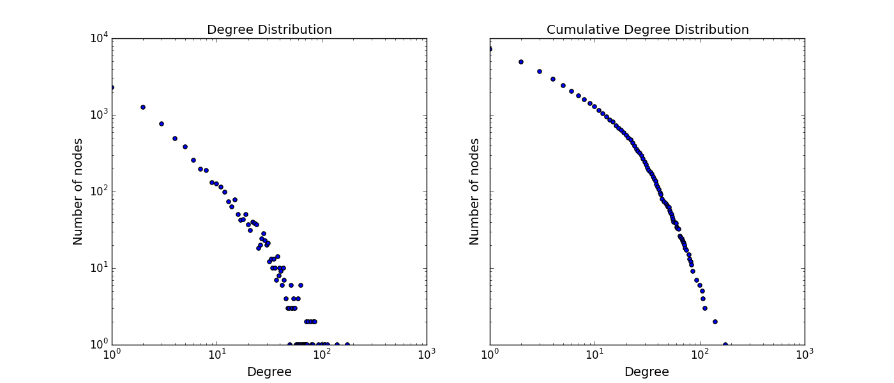
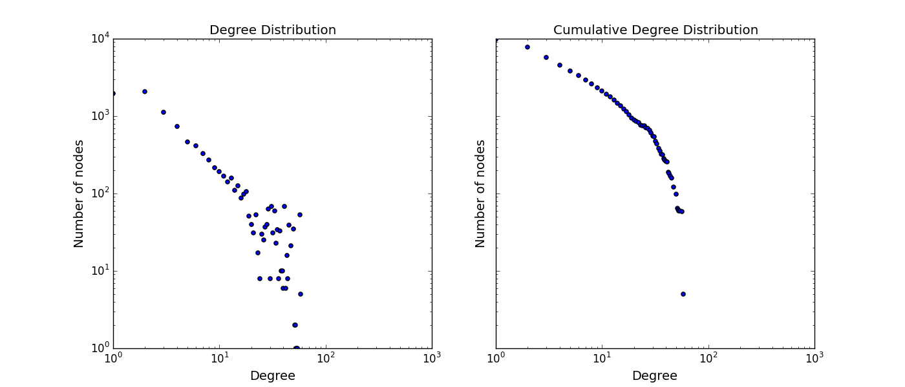
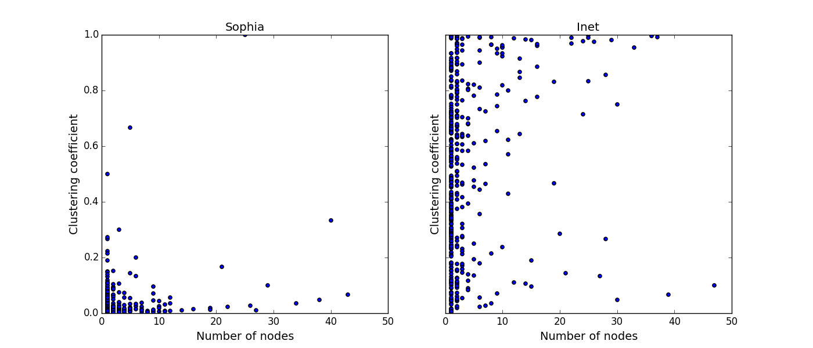
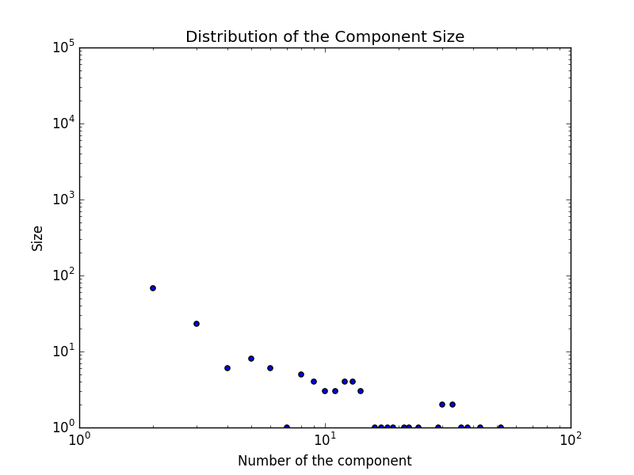
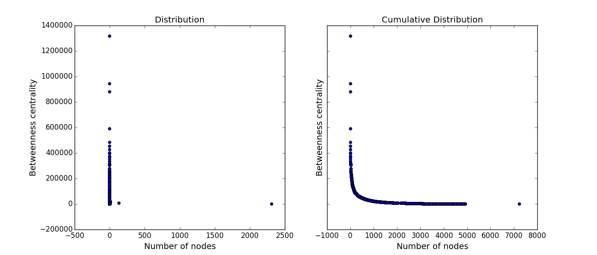
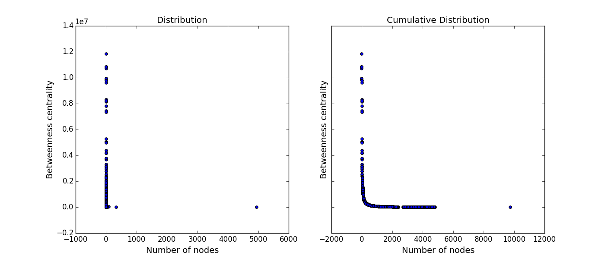

# M2 - NSD Lab1 Report

Name: Zhou Quan

Date: 2015-10-02 

--
[*[Source Code]*][10]
## Basic operations and properties
#### Exercise 2 — Size of a graph

The program computes and stores it in file `(*)_graphe.n`. *And (\*) is the name of the file.*

```python
g = Graph('dataset.txt') # add dataset '*.txt'
g.compute_node_number() 
```

**Size for sophia network:**`7235`  **Filename:** [`drosophila_PPI_graphe.n`][1]

**Size for inet network:**`9757`   **Filename:** [`inet_graphe.n`][2]

[1]: https://github.com/JoshPAT/network-structure-and-dynamics/blob/master/exercise_2/datasets/drosophila_PPI_graphe.n
[2]: https://github.com/JoshPAT/network-structure-and-dynamics/blob/master/exercise_2/datasets/inet_graphe.n

#### Exercise 3 — Node degree
The program computes and stores it in file `(*)_graphe.deg`. *And (\*) is the name of the file.*

```python
g.compute_node_degree() 
```

**Filename:** [`drosophila_PPI_graphe.deg`][3]
**Filename:** [`inet_graphe.deg`][4]

[3]: https://github.com/JoshPAT/network-structure-and-dynamics/blob/master/exercise_2/datasets/drosophila_PPI_graphe.deg
[4]: https://github.com/JoshPAT/network-structure-and-dynamics/blob/master/exercise_2/datasets/inet_graphe.deg

#### Exercise 4 — Loading a graph in memory
The program returns a list which stores the graph in memory way.

```python
print g.store_in_memory()
```

#### Exercise 5 — Number of isolated nodes
The program prints the *number of nodes of degree 0 of a graph*, as well as *the density*, *the average degree*, *the minimum and maximum degree of the graph*.

```python
g.graph_infos() 
```
Graph infomation for **sophia network** are as follows:

```bash
Numbers of degree 0: 0
Max Degree: 176
Min Degree: 1
Average Degree: 6.15533443892
Density of graph: 0.000850771864398
```
Graph infomation for **inet network** are as follows:

```bash
Numbers of degree 0: 18
Max Degree: 58
Min Degree: 0
Average Degree: 7.28981348637
Density of graph: 0.000747136772202
```

> Question: Is it necessary to store the graph in memory for this purpose ?

> Answers: Not really. Although it can save memory by saving only existing edges instead of bundles of meaningless number in array matrix, for this purpose, it is much more easier to just use the degree table we has previously computed.

```python   
print 'Numbers of degree 0: %s' % g.degree_table.count(0)
print 'Max Degree: %s' % max(g.degree_table) 
print 'Min Degree: %s' % min(g.degree_table)
print 'Average Degree: %s' % (sum(g.degree_table) * 1.0 / len(g.degree_table))
print 'Density of graph: %s' % (1.0 * sum(g.degree_table) / \
                               (len(g.degree_table) * (len(g.degree_table) - 1)))

```


#### Exercise 6 — Degree distribution

The program computes and stores it in file `(*)_graphe.dn`. *And (\*) is the name of the file.*

```python
g.compute_degree_distribution()
```

**Filename:** [`drosophila_PPI_graphe.dn`][5]

**Filename:** [`inet_graphe.dn`][6]

[5]: https://github.com/JoshPAT/network-structure-and-dynamics/blob/master/exercise_2/datasets/drosophila_PPI_graphe.dn
[6]: https://github.com/JoshPAT/network-structure-and-dynamics/blob/master/exercise_2/datasets/inet_graphe.dn


#### Exercise 7 — Delete loops

After reading the dataset file, the program will delete potienial loops initally and then do the computes.

#### Exercise 8 & 9 — Application

The programs integrates all infos shown before.

```python
g.compute_all() # includes cumulative degree distribution
```
Degree Distribution and Cumulative Degree Distribution of graph for **sophia network** are as follows:



Degree Distribution and Cumulative Degree Distribution of graph for **inet network** are as follows:



> Comments : As we can see from the figures before, in **sofia network** number of nodes increase when its degree decreases. This network strictly follows the power law, which means it is a heterogeneous network. While **inet network** has shown the poteinal being follow the power law, but number of nodes turns to be normalized when degree of the node is lower than $log(10^2)$，which is *10*. From this figure,we can't say **inet network** is a heterogeneous network.

> According to the definition of cumulative distribution, here it describes the number of nodes that their degree are lower or equals to degree *K*. But here I think it's better to use inverse cumulative distribution to explain, which describes number of nodes have degree bigger than *K*. As we can clearly see in the **sofia network**, it shows the same property we see before, the number of nodes decrease when their degree becomes bigger than *K*. And in the case of **inet network**, it shows that it actually follows the power law, in this way, we can infer that **inet network** is a heterogeneous network.


## Local density vs global density

#### Exercise 10 — Clustering coefficient and transitive ratio

The program computes both two values - clustering coefficient and transitive ratio in one method.

```python
g.compute_triangle_values() # computes and prints both values
```
The figure displays the clustering coefficient of each node in both network, and from this figure, we can say that **sophia** is a loosely connceted network since most nodes have low clustering coefficient, while **inet** is a random and evenly distributed network. 



Transitive ratio for **sophia network** are as follows and it shows that **sophia network** is a globally loose network:

```bash
transitive ratio: 0.01425574417
```
Transitive ratio for **inet network** are as follows it shows that **inet network** is a globally dense network:

```bash
transitive ratio: 0.87710842352
```
Computation time for both networks are as follows:

```c
Computation Time of Compute_triangle_values in sophia: [0.47 - 0.53] seconds
Computation Time of Compute_triangle_values in inet: [0.66 - 0.71] seconds
```
> Considering the efficiency of the program, it will iteratives all the nodes，and checks its neighbours's neighour is also its own neighbour. And Its complexity is $O(n^3)$. 


## Breadth first search

#### Exercise 11 — Breadth first search

The program will display the BFS of the Graph from node `s`:

```python
b = Bfs(g) # add graph to bfs comupting
b.bfs(s) # s is the start node
```

#### Exercise 12 — Size of the connected components
The program will display the size of each connected components of a given graph and one of its seed node `s`.

```python
b.compute_size() 
```
For **sohpia network**, there is only one big connected component:

```bash
component: 0, size: 7236 # biggest node is 7235
```

For **inet network**, we can see that distibution of connected component size.


> In **inet network**, there are a lot of disconnected component in the network and the size of them are very small, it can be explained as some local networks are disconnected to the Internet.


#### Exercise 13 — Principal connected component 

Once we know the size of the component, we can isolates the bigggest component by its seed node, and thus have the principal connected component.

```python
print b.biggest_componet
```

#### Exercise 14 — Set of shortest paths

The program will compute the set of shortest paths based on the seed `s` and the component it comes from:

```python
print b.set_of_shortest_paths(s)
```
The complexity of the algorithm is $O(n^2)$.

#### Exercise 15 — Number of shortest paths

The program will compute the number of shortest path go through `v` started from seed node `s` based on the formula that 
$$
n(v) = dn * dp 
$$

```python
b.number_of_shortest_paths(s, v) 
```

#### Exercise 16 — Betweenness centrality
If using the previous exercises before, the compltexity of betweenness centrality would be $O(n^3)$. 

```python
b.betweenness_centrality() 
```
And I also tried [*BRANDES*][9] Algorithm, whose complexity is only $O(m+n)$.

```python
b.new_betweenness_centrality() 
```
> For the big networks like sophia and inet, it will inefficiently use the simple bfs way to compute, and the faster algorithm proposed by Brandes is more qualified  to do this computation.
 
 **Filename:** [`drosophila_PPI_bc.dn`][7]

**Filename:** [`inet_bc.dn`][8]

[7]: https://github.com/JoshPAT/network-structure-and-dynamics/blob/master/exercise_2/datasets/drosophila_PPI_bc.dn
[8]: https://github.com/JoshPAT/network-structure-and-dynamics/blob/master/exercise_2/datasets/inet_bc.dn
 
 
 
Betweenness centrality Distribution and Cumulative Betweenness centrality Distribution of graph for **sophia network** are as follows after I apply the new algorithm:



Betweenness centrality Distribution and Cumulative Betweenness centrality Distribution of graph for **inet network** are as follows after I apply the new algorithm:



-
[9]: http://algo.uni-konstanz.de/publications/b-fabc-01.pdf
[10]: https://github.com/JoshPAT/network-structure-and-dynamics/blob/master/exercise_2/nsd_homework_1.py