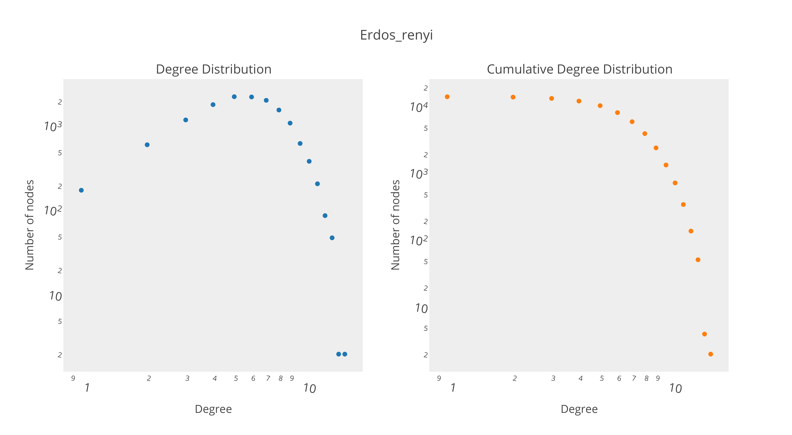
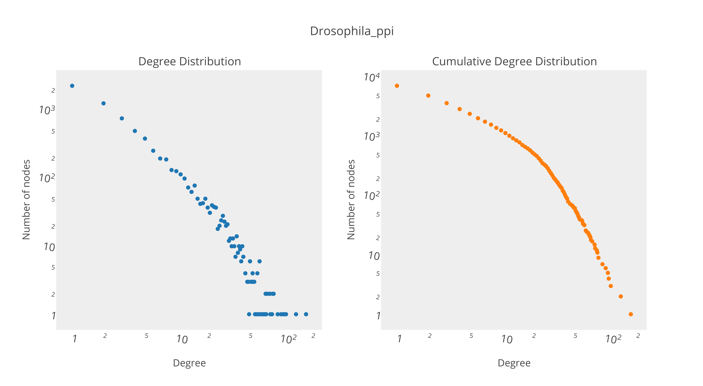
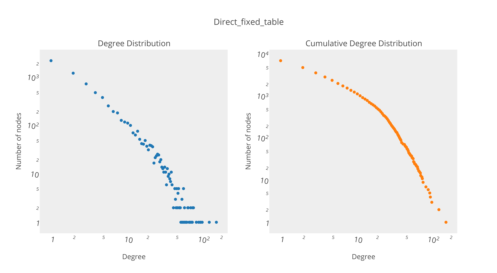
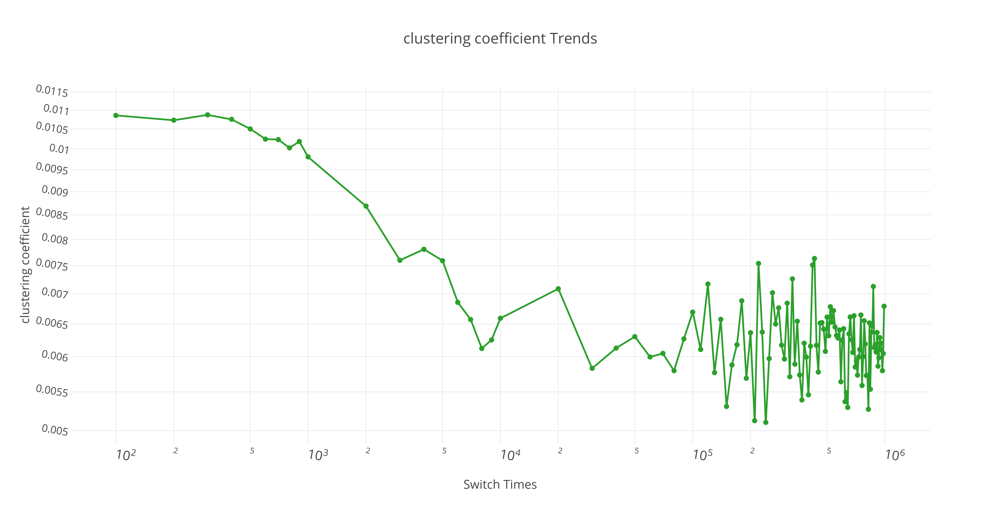
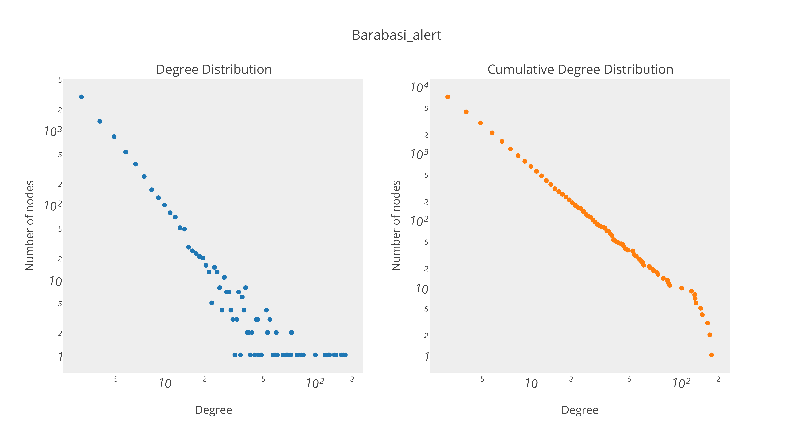
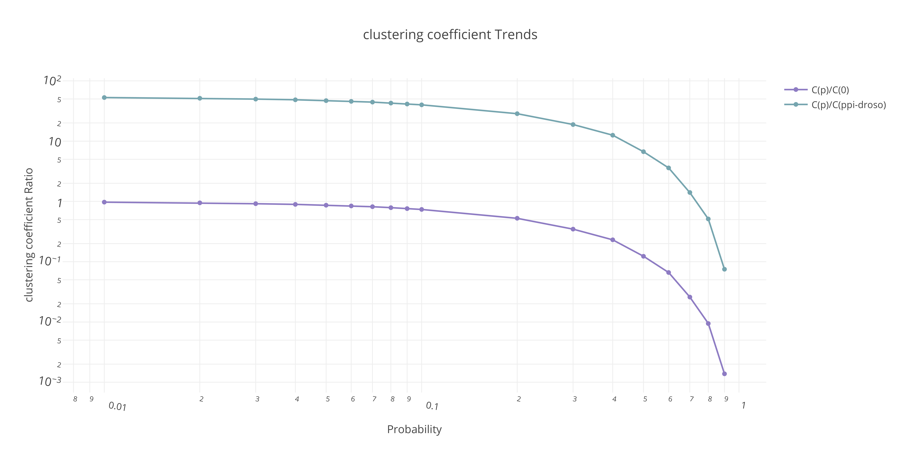
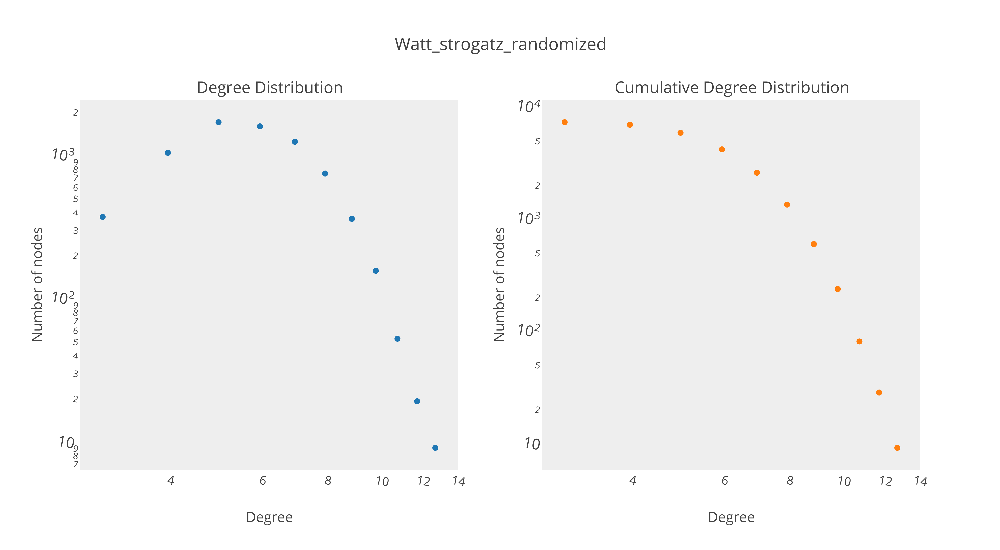

# M2 - NSD Lab2 Report

Name: Zhou Quan

Date: 2015-10-16   

--

[*[Source Code]*][1]

[1]: https://github.com/JoshPAT/network-structure-and-dynamics/blob/master/exercise_3/models.py

## Erdos-Renyi random graphs

### Generation

Bascially, I generate the graph by randomly connecting `n` nodes until there is `m` edges. I avoid generating loops but multiple edges are allowed in the graph.

### Characteristics

The characteristics of **erdos-renyi** generated by defining n = 7236 nodes and m = 22270 edges are shown below:

```bash
# Degree
Numbers of degree 0: 12
Max Degree: 19
Min Degree: 0
Average Degree: 6.15091210614
# Density
Density: 0.00170079134
# Connected Component
component: 0, size: 7224
component: connectless, size: 12
biggest component: 0, size: 7224
# Clustering
transitive ratio: 0.00065916199
average clustering coefficient: 0.00066435292
# Distance
average distance: 5.10203144747 
```

Degree Distribution and Cumulative Degree Distribution of graph for **erdos-renyi** are as follows:



> Comments:
> 
> 1. Density is very low and this is expected low because we have set the parameters of `n`, `m`.
> 2. There is only one big connected component with a lof of nodes, and very few disconnected nodes.
> 3. Clustering is very low.
> 4. Average distance is `5`, which is close to $log(n)$.
> 5. The Degree Distribution follows the poisson distribution, we can say it is a homogenous network as we expected.
> 

### Comparison to PPI-DROSO network

The characteristics of **ppi-droso** network are shown below:

```bash
# Degree
Numbers of degree 0: 0
Max Degree: 176
Min Degree: 1
Average Degree: 6.15533443892
# Density
Density: 0.00170201416
# Connected Component
component: 0, size: 7236
biggest component: 0, size: 7236
# Clustering
transitive ratio: 0.01425574417
average clustering coefficient: 0.01105530603
# Distance
average distance: 4.44950002349
```
Degree Distribution and Cumulative Degree Distribution of graph for **ppi-droso** are as follows:



> Comments:
> 
> 1. Density is as low as `erdos-renyi's` density.
> 2. There is only one big connected component with a lof of nodes, and no disconnected node.
> 3. Clustering is twenty times bigger than clustering of `erdos-renyi`, it is much higer.
> 4. Average distance is `4`, which is also close to $log(n)$.
> 5. The Degree Distribution follows power law, and Inverse Culmulative Degree Distribution looks like a linearer graph. So we can say it is a hetergenous network as we expected.


|| Density |   Connected Component | Clustering |Average distance|Degree Distribution|
|:-------| :------- | :----: | :---: | :---: | :---: | :---: |
| ppi-droso  | low | big component| high| low| hetergenous|
| erdos-renyi| low | big component| very low | low| homogenous|

>
> Conclusion:
> 
> *Real-world complex networks are very different from random Erdös-Rényi graphs.*
> 
> We need another model to simluate since there are only a few resemblances bewteen random graph and real world graph.


## Fixed Degree Random graphs

### Generation with direct method

I generate the graph using the followed alogrithm:

```python
#begin
    Make a table of fixed degree: m[]
    i = length(m)
    while i > 0:
        u = random(0, i -1)
        v = random(0, i -2)
        swap(m[u], m[i-1])
        swap(m[v], m[i-2])
        i = i -2
    #end
#end
```
### Generation with switch method

I generate the graph using the followed alogrithm:

```python
#begin
    Read the existing edges: E{e(node1, node2)} 
    n is switch times
    while n > 0:
        e(u,v) = random(E)
        e(m,l) = random(E)
        swap(v, l) in [e(u, v) and e(m, l)]
        n = n - 1
    #end
#end
```

### Comparison to PPI-DROSO network

The characteristics of **graph with direct method** network are shown below:

```bash
# Degree
Numbers of degree 0: 0
Max Degree: 168
Min Degree: 1
Average Degree: 6.12548369265
# Density
Density: 0.00169376012
# Connected Component
component: 0, size: 7128
some small components, size: 2
biggest component: 0, size: 7128
# Clustering
transitive ratio: 0.00917903119
average clustering coefficient: 0.00688555570
# Distance
average distance: 4.26987911480
```


> Comments:
> 
>  *Mutiple edges are allowed in this Graph*
> 
> 1. Density is low.
> 2. There is only one big connected component with a lof of nodes, and some disconnected node.
> 3. Clustering is ten times lower than `ppi-droso`. 
> 4. Average distance is `4`, which is also close to $log(n)$.
> 5. The Degree Distribution follows power law, and Inverse Culmulative Degree Distribution looks like a linearer graph. So we can say it is a hetergenous network as we expected.


The characteristics of **graph with siwtch method** network are shown below:

```bash
# Degree
Numbers of degree 0: 0
Max Degree: 176
Min Degree: 1
Average Degree: 6.15533443892
# Density
Density: 0.00170201416
# Connected Component
component: 0, size: 7114
some small components, size: 2 or 3
biggest component: 0, size: 7114
# Clustering
transitive ratio: 0.00871438790
average clustering coefficient: 0.00699457448
# Distance
average distance: 4.24750632793
```


The process of switching can be observed as follows:



> Comments:
> 
>  *Both Loops and Mutiple edges are not allowed during generation in this Graph*
> 
> 1. Density is exactly same as `ppi-droso`.
> 2. There is only one big connected component with a lof of nodes, and some disconnected node.
> 3. Clustering is ten times lower than `ppi-droso`. 
> 4. Average distance is `4`, which is also close to $log(n)$.
> 5. The Degree Distribution and Inverse Culmulative Degree Distribution is identical to `ppi-droso`.
> 6. As we can oberserved in the clustering coefficient trends, the clustering parameter starts to decrease when switch times increases, and after certain times of switching, the clustering parameter tends to fluctuate around around `0.006`. It means that we have visited all the elements in the graph.
> 

|| Density |   Connected Component | Clustering |Average distance|Degree Distribution|
|:-------| :------- | :----: | :---: | :---: | :---: | :---: |
| ppi-droso  | low | big component| high| low| hetergenous|
| direct random| low | big component| low | low| hetergenous|
| switch random| low | big component| low | low| hetergenous|

> Conclusion:
> 
> Although we successfully created that the graph is hetergenous, but the clustering property often seen in real world graph is not created through this model.
> 
 
## Barabasi-Albert random graphs

### Generation

I generate the graph using the followed alogrithm:

```python
#begin
    nodes: n
    degree: k 
    i = n0 # inital graph
    while i <= n:
        # add the link according to probability, 
        # which is proportional to degree of j.
        e(i,j) = random.choice(p(j))
        i = i + 1
    #end
#end
```

### Comparison to PPI-DROSO network

The characteristics of **barabasi-albert** network are shown below:

```bash
# Degree
Numbers of degree 0: 0
Max Degree: 185
Min Degree: 3
Average Degree: 5.99751243781
# Density
Density: 0.00165837473
# Connected Component
component: 0, size: 7236
biggest component: 0, size: 7236
# Clustering
transitive ratio: 0.00317530208
average clustering coefficient: 0.00602541057
# Distance
average distance: 4.19311566257
```


> Comments:
> 
>  *Both Loops and Mutiple edges will not be generated in this Graph*
> 
> 1. Max Dregree is `185`, which means there is a `richest node`.
> 2. Density is exactly same as `ppi-droso`.
> 3. There is only one big connected component with a lof of nodes, and no disconnected node.
> 4. Clustering is ten times lower than `ppi-droso`.
> 5. Average distance is `4`, which is also close to $log(n)$.
> 6. The Degree Distribution follows exactly power law, and Inverse Culmulative Degree Distribution is a linearer graph. So it is a typical hetergenous network.
> 

|| Density |   Connected Component | Clustering |Average distance|Degree Distribution|
|:-------| :------- | :----: | :---: | :---: | :---: | :---: |
| ppi-droso  | low | big component| high| low| hetergenous|
| barabasi-alert| low | big component| low | low| hetergenous|

> Conclusion:
> 
> Barabasi-alert is a typical scale-free network, which can be often seen in our real world, like the structure of internet, citations.
> But In real world, the graph doesn't exactly follows the power law. This could be a issue for this model.
> 

## Watts-Strogatz random graphs

### Generation

I generate the graph using the followed alogrithm:

```python
#begin
    degree: k
    nodes: n
    probability: p
    
    # Create a list that every u,v is connected to k nodes
    # and it connects to its k/2 neighours on each side
    # Basically a regular ring lattice
    
    create E{e(u,v)} 
    # for every link in Edges
    
    for e(u,v) in E: 
       if p: # with probability
            n = random.pick(N) # pick a random node
            E.remove(e(u,v)) 
            E.add(e(u,n)) # rewire the link
    #end
#end
```

### Comparison to PPI-DROSO network

The clustering coefficient trends of **watts-strogatz** is showed as below:



> Comments:
>
> 1. The process shown in the figure is actually a process that randomizes a regular graph. It starts from `p=0.01` to `p=0.9` to rewire a link.
> Because the increase probability to rewire makes 'friends of friends' links less and less ,thus clustering coefficient decrease.
> 2. We can clustering coefficient will be the same as **ppi-droso**. The probability is around `0.73`.

So I generate a **watts-strogatz** with probability `p = 0.73`:

```bash
# Degree
Numbers of degree 0: 0
Max Degree: 13
Min Degree: 3
Average Degree: 5.99751209399
# Density
Density: 0.00165860394
# Connected Component
component: 0, size: 7235
biggest component: 0, size: 7235
# Clustering
transitive ratio: 0.01055375582
average clustering coefficient: 0.01166837110
# Distance
average distance: 5.30820984910
```



> Comments:
> 
> 1. Density is low.
> 2. There is only one big connected component with a lof of nodes, and no disconnected node.
> 3. Clustering is the same as `ppi-droso`.
> 4. Average distance is `5`, which is also close to $log(n)$.
> 5. The Degree Distribution follows the poisson distribution, we can say it is a homogenous network as we expected.

|| Density |   Connected Component | Clustering |Average distance|Degree Distribution|
|:-------| :------- | :----: | :---: | :---: | :---: | :---: |
| ppi-droso  | low | big component| high| low| hetergenous|
| watts-strogatz| low | big component| high | low| homogenous|

> Conclusion:
> 
> With Watts-strogatz model, we can randomized a regular network to obtain high clustering as the network in real-world.
> However, it is a homogenous network.
> 

-------